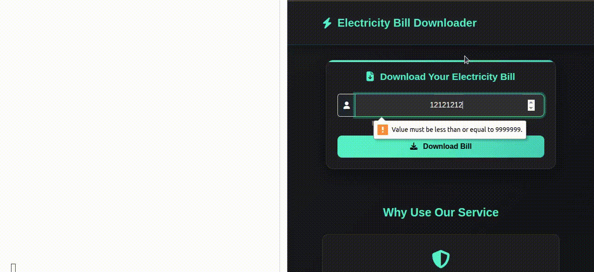

# ⚡ Electricity Bill Downloader

A Python Flask web application that automates downloading electricity bills from LESCO's official site using Selenium. It handles CAPTCHA solving (OCR), extracts billing details, and generates a PDF of the bill.



---

## 🚀 Features

- Enter 7-digit Customer ID to download your bill.
- Automatically fills CAPTCHA using OCR.
- Downloads and saves bill as a PDF file.
- Displays loading spinner and success alert.
- Clean Bootstrap UI with dark mode.

---

## 🧰 Tech Stack

- **Backend**: Python, Flask
- **Automation**: Selenium, Tesseract OCR, ChromeDriver
- **Frontend**: Bootstrap 5, JavaScript
- **Extras**: Pillow, pytesseract, PDF generation via DevTools Protocol

---

## 📂 Folder Structure

project-root/
│
├── app.py # Flask server
├── bill_downloader.py # Selenium automation logic
├── templates/
│ └── index.html # Main HTML page
├── static/
│ ├── css/
│ │ └── style.css # Custom CSS
│ └── output.gif # Demo GIF
└── README.md # This file


---

## 🔧 Setup Instructions

### 1. Clone the repo
```bash
git clone https://github.com/yourusername/bill-downloader.git
cd bill-downloader
```
2. Create virtual environment
```
python3 -m venv venv
source venv/bin/activate
```
3. Install dependencies
```
pip install -r requirements.txt
```
4. Make sure you have Chrome + ChromeDriver installed(Driver-manager)
5. Install Tesseract OCR
```
sudo apt update
sudo apt install tesseract-ocr
```

▶️ Run the App
```
flask run
```
Then open your browser at: http://127.0.0.1:5000


